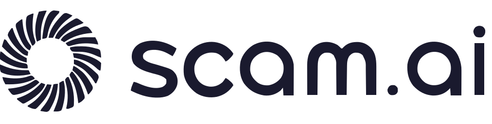
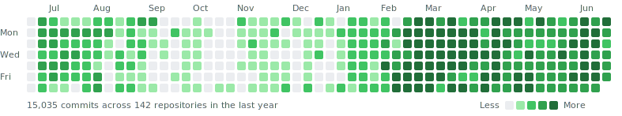

  <picture>
    <source media="(prefers-color-scheme: dark)" srcset="scamai-logo-light.svg"/>
    <source media="(prefers-color-scheme: light)" srcset="scamai-logo-dark.svg"/>
    
  </picture>
  <h3>Building Trust in the AI Era 🛡️</h3>
  

    An AI-powered platform for detecting deepfakes and synthetic media in real time.
     
    95.3% detection accuracy. Processing times under 200ms.
  

  

    <a href="https://scam.ai"><strong>Website</strong></a> ·
    <a href="https://cal.com/scamai/15min"><strong>Request a Demo</strong></a> ·
    <a href="https://www.producthunt.com/products/scam-ai"><strong>Product Hunt</strong></a>
  

---

## 👋 About Us

**Scam.ai** is an AI-powered platform for detecting deepfakes and synthetic media in real time. We help businesses verify identity, authenticate content, and build trust in the AI era.

Backed by **[Berkeley SkyDeck](https://skydeck.berkeley.edu/)** ([Batch 20](https://skydeck.berkeley.edu/batch20/)) with **$2.5M in seed funding**.

## ✨ Our Technology

* **🤖 Eva Detection Models:** Our proprietary Eva-v1-Fast and Eva-v1-Pro models deliver industry-leading deepfake detection across images, video, and audio.
* **🎭 Multi-Modal Analysis:** Vision detection, audio detection, and GenAI content verification — covering the full spectrum of synthetic media threats.
* **🔌 Developer-Friendly APIs:** RESTful APIs designed for easy integration — get up and running in under 10 minutes.
* **🏢 Enterprise Ready:** SOC 2 Type II certified and GDPR compliant, with ScamDB-powered threat intelligence built in.

## 🔬 Open Research & Open Source

Our core detection engine is closed-source, but we share research, datasets, and tools with the community:

* **[gpt-image-2-dataset](https://github.com/scamai/gpt-image-2-dataset):** Collection pipeline for 10,217 confirmed GPT-Image-2 images found in the wild — code for our dataset paper.
* **[scamai-deepfake-detector-dataset](https://github.com/scamai/scamai-deepfake-detector-dataset):** Benchmark dataset from our research paper *"Do Deepfake Detectors Work in Reality?"*
* **[PII_ZERO](https://github.com/scamai/PII_ZERO):** Open-source, multi-modal, local-first PII removal — private, auditable, and compliant.

Found a security issue? See our [Security Policy](https://github.com/scamai/.github/blob/main/SECURITY.md).

## 📈 Always Shipping

Most of our work happens in private repositories — here is the daily commit activity across every repo we have, public and private, refreshed daily:

<picture>
  <source media="(prefers-color-scheme: dark)" srcset="contribution-wall-dark.svg"/>
  <source media="(prefers-color-scheme: light)" srcset="contribution-wall-light.svg"/>
  
</picture>

## 🤝 Get in Touch

* **Request a Demo:** See our technology in action by [scheduling a demo with our team](https://cal.com/scamai/15min).
* **Contact Us:** Have questions or want to partner with us? [Email us at contact@scam.ai](mailto:contact@scam.ai?subject=Inquiry%20from%20GitHub).

  
Made with ❤️ around the World 🇺🇸 🇨🇦 🇨🇳 🇮🇳 🇸🇬 ...

